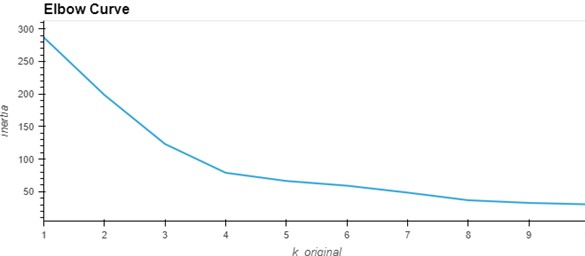
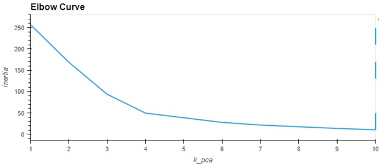
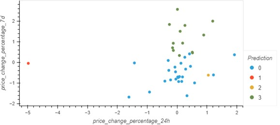
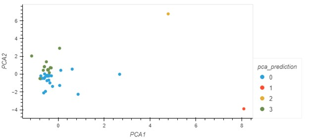

# CryptoClustering

## Overview
The Crypto Clustering project aims to predict if cryptocurrencies are affected by 24-hour or 7-day price changes using unsupervised learning techniques, specifically K-means clustering. Additionally, the project explores the impact of dimensionality reduction using Principal Component Analysis (PCA) on clustering.  
## Steps
Load and preprocess the data.
Scale the data using StandardScaler.
Find the best value for k using the elbow method.
Cluster cryptocurrencies with K-means using the original scaled data.
Perform PCA to reduce the features to three principal components.
Find the best value for k using the PCA data.
Cluster cryptocurrencies with K-means using the PCA data.
Visualize and compare the results using hvPlot.
 
## Results
The project includes the following visualations:
1. Elbow Curve for the original data. 
 
2. Elbow Curve for the PCA data. 
 
3. Scatter plot of cryptocurrency clusters based on the original data.
 
4. Scatter plot of cryptocurrency clusters based on the PCA data.
 

## Conclusion 
The impact of using PCA data resulted in tighter clusters. The original data had an outlier at (-5,0) while the PCA data now has predictions in (5,7) and (8, -4) 
## Dependencies
* Python
* pandas
* NumPu
* scikit-learn
* hvPlot
